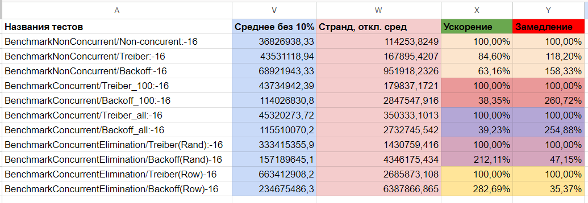

# Задача 1
Для запуска тестов вызвать команду:
```bash
❯ go test -v . -bench=.
```

Для проверки на race-conditions добавьте 
```bash
❯ go test -v . -bench=. -race
```

## Цель
Реализовать и сравненить 3 стека: неконкурентный, стек Трайбера, стек с back-off элиминацией

## Эксперимент
Используемый тестовый стенд:
```
WSL 2, Windows 11.
CPU: AMD Ryzen 7 5800U with Radeon Graphics
RAM: 16 GB
```

Запустим бенчмарки на трех реализациях.

Будем запускать на таких сценариях:
1. Push numberOfElements раз, а затем Pop столько же неконкурентно
2. Push numberOfElements раз, а затем Pop столько же с использованием 100 горутин
3. Push numberOfElements раз, а затем Pop столько же с использованием numberOfElements горутин
4. Случайная последовательность Push и Pop c использованием 200к горутин (100к на вставку, 100к на удаление)
5. 200k горутин делают Push и Pop последовательно 
## Результаты

Сырые результаты можно посмотреть в [./results.txt](./results.txt).

Обработанные результаты доступны по ссылке: https://docs.google.com/spreadsheets/d/1DHnuDydF5i8uRhyZt_dw2_FwfVCZha40xVyexCx8aD0/edit?usp=sharing

А так же в таблице ниже:



## Выводы

Под "A быстрее B" понимается следущее: количество операций выполняемых в наносекунду у A больше, чем у B.

1. Обе конкурентные версии медленнее обычного стека при неконкурентной вставке от 18% до 50%
2. В 100 горутинной версии стек с back-off элиминацией медленнее стека Трайбера в 2.6 раз
3. В 1_000_000 горутинной версии стек с back-off элиминацией медленнее стека Трайбера в 2.5 раза
4. При рандомной вставке/удалении стек с back-off элиминацией в 2.1 раза быстрее Трайбера
5. При последовательности операций Push затем Pop стек с back-off элиминацией в 2.8 раза быстрее Трайбера

Это значит, что:
1.  для поледовательных программ стоит использовать обычный стек.
2. независимо от количества горутин при Push numberOfElements раз, а затем Pop столько же стек Трайбера быстрее в приблизительно одинаковое количество раз
3. Стек с back-off элиминацией особенно эфективен, когда порядок вставки неопределен или происходит в последовательности Push и Pop

Если мы сначала вставляем элементы, а затем после полной вставки удаляем, то стек с back-off элиминацией проигрывает стеку Трайбера, потому что за время ожидания никогда не случается так, что найдется комплиментарная операция.

